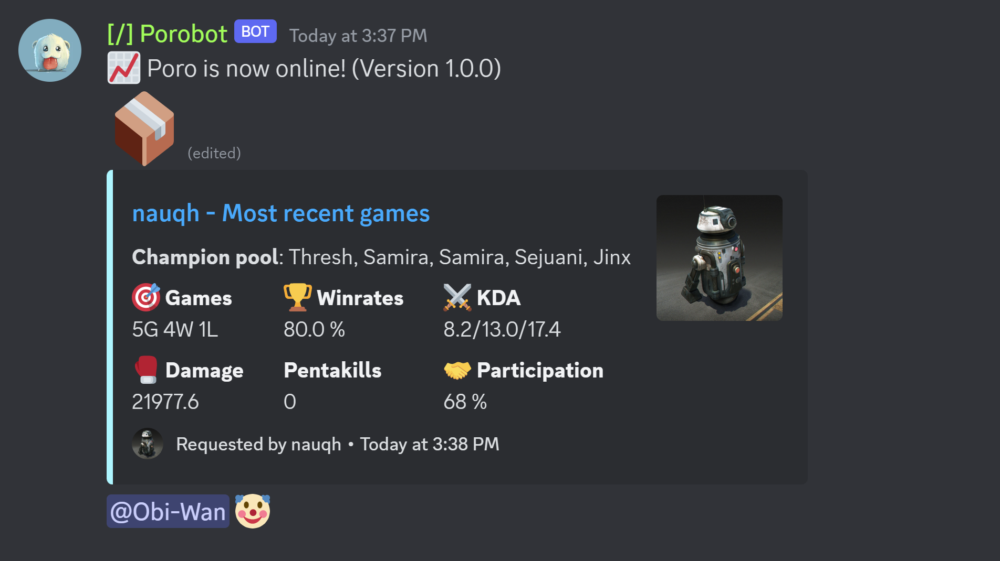
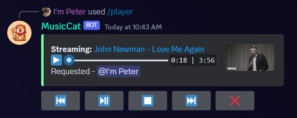

# :fontawesome-solid-circle-question: FAQ

**Last edited**: 12/07/2023 - Nauqh

## Frequently Asked Questions

Here you can find some of the most frequently asked questions from our support channels.

If you don’t know how to use a command, you can run `?help [commandname]` and Poro will respond with the help text for that command. The help text will include a brief explanation and usage examples.

Command or Module not working? Try `?diagnose [commandname]` or `?diagnose [modulename]` and any issues with the command/module will be listed there.

Can’t find the answer you’re looking for? Have a feature request? Join us on the **[Poro server]()** and let us know!

## General FAQ
<!-- **I’m new to Poro. Where do I start?**

- If you haven’t already, invite Dyno at dyno.gg/invite.
- You will be redirected to your server’s dashboard. You can configure most modules and settings here as well as view logs for your server.
- To get to your server’s dashboard, go to dyno.gg/account, login if necessary, and select your server from the list.
- To view a list of Dyno’s commands, go to dyno.gg/docs/commands.
- To view documentation for all of Dyno’s features, check out dyno.gg/docs.
- To watch the many visual guides on our YouTube channel, visit youtube.com/c/How2Dyno -->

**The bot is responding, but I can't hear it play music?**

Make sure MusicCat is not muted for you by right clicking it in your voice channel. If it is not muted then try changing the voice region in Server Settings (you can change it right back).This will reset the voice connection to discord servers which may be wonky at times.

If that doesn't resolve your issue, you can also try issuing the `/leave` and `/join` command.

=== "Porobot"

    

    * Sed sagittis eleifend rutrum
    * Donec vitae suscipit est
    * Nulla tempor lobortis orci

=== "MusicCat"

    

    1. Sed sagittis eleifend rutrum
    2. Donec vitae suscipit est
    3. Nulla tempor lobortis orci

[Send :fontawesome-solid-paper-plane:](#){ .md-button }
