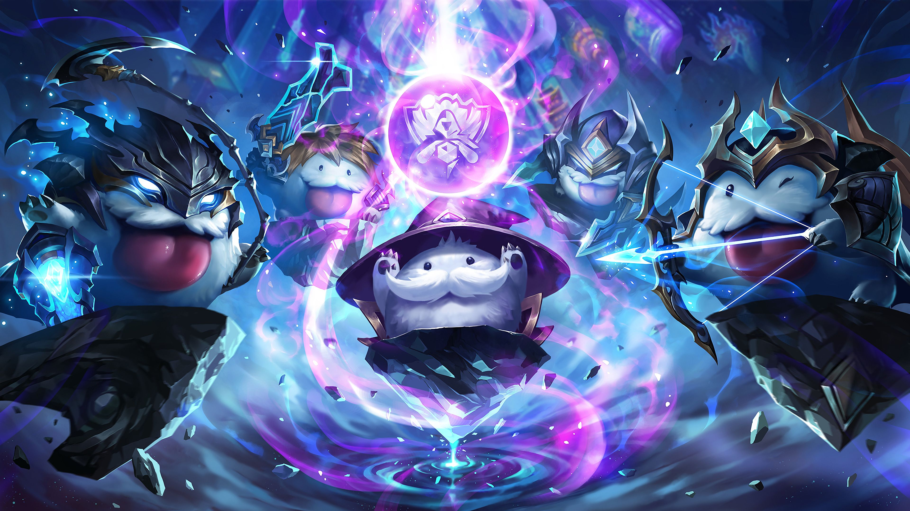

# Welcome to Poro Docs

**Update** (12 July 2023): Invite Porobot to your discord server at [Porobot](https://nauqh.github.io/error.html)

## About the project

Porobot is a compact system for gathering and organizing game statistics data from [Riot API](https://developer.riotgames.com/).

In short, it allows you to:

* Retrieve player statistics such as match history, ranked information, or even custom data of your choice.
* Store the data in a scalable database using technologies like [PostgreSQL](https://www.postgresql.org/) and [SQLAlchemy](https://www.sqlalchemy.org/).
* Utilize various tools to model and analyze the behavioral data.
* Generate reports and deploy an online dashboard for convenient management.
* Poro's music subsystem - **MusicCat** can stream audio from Spotify, Youtube as well as supports playlists and livestreams.

## Techstack

The repository structure follows the conceptual architecture of Porobot, which consists of five loosely-coupled sub-systems.

To briefly explain these five sub-systems:

* **[Extractor][extractor]** employs `Pydantic` to validate the integrity and quality of the extracted Riot data through customizable data quality checks and adherence to expected schema and format.
* **[Storage][storage]** relies on `SQLite` as a robust and feature-rich database system for persistent storage of Riot and Discord data, while leveraging `SQLAlchemy` as the ORM tool for simplified interaction with the database.
* **[Analytics][analytics]** employs `Plotly` for creating interactive and visually appealing data visualizations, `Pandas` for data transformation and analysis, and `Discord` for deploying intuitive and user-friendly dashboards to explore and analyze Riot data.
* **[Application][app]** utilizes `Hikari` as the library for building a Discord bot, providing a powerful and efficient framework for interacting with the `Discord API` and creating engaging and interactive experiences for users.
* **[Music Player][music-player]** harnesses the power of the `Lavalink` library and employs `Lavacord` as Python client to deliver seamless integration with popular music streaming platforms, providing high-quality audio playback, extensive music control features, and support for various music sources and formats.

## Documentation

Since Porobot is built on the basis of Hikari library, it is essential to look for the library documentation for further implementation. 

- Hikari: [hikari-py.dev](https://www.hikari-py.dev/)
- Lightbulb: [lightbulb.readthedocs.io](https://hikari-lightbulb.readthedocs.io/en/latest/)
- RiotAPI: [developer.riotgames.com](https://developer.riotgames.com/)
- Lavalink: [lavalink-devs/Lavalink](https://github.com/lavalink-devs/Lavalink)

## Contributors

- [x] Nauqh - [@nauqh](https://github.com/nauqh) 

- [x] Peter - [@bachtran02](https://github.com/bachtran02) 

- [x] Tuanardo - [@anhtuan18602](https://github.com/anhtuan18602) 

[orchestrator]: https://www.prefect.io/
[extractor]: https://developer.spotify.com/documentation/web-api
[storage]: https://www.postgresql.org/
[analytics]: https://resonance.streamlit.app/
[app]: https://www.hikari-py.dev/
[music-player]: https://github.com/lavalink-devs/Lavalink